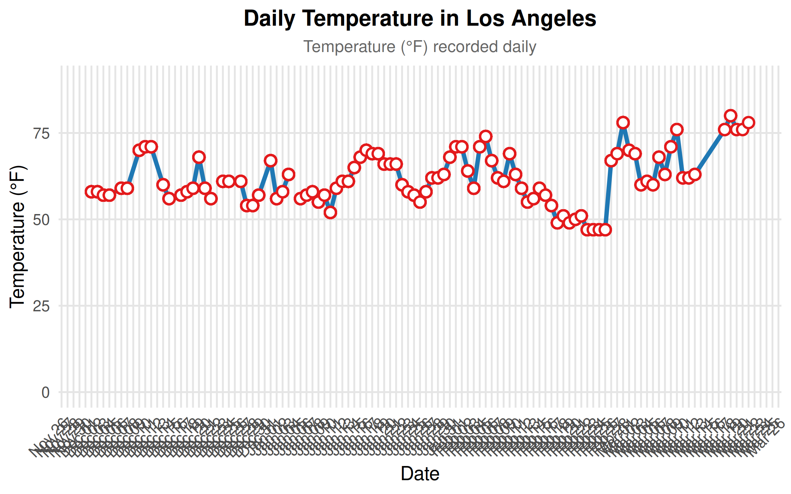
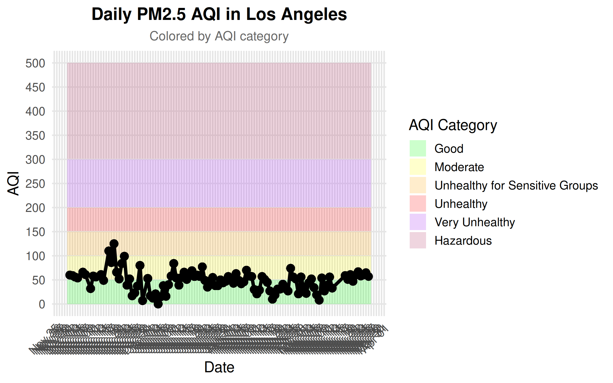

# LA_AQI-TEMP
Daily Los Angeles Air quality and temperature data and visualizations.

The sources for my data are [airnowapi](https://docs.airnowapi.org/) and [api.weather.gov](https://api.weather.gov/)

## Latest Daily Visualizations

## Summary/Reflection

I have two sources of data for these visualizations. The first is through an API for weather air quality. This data that is returned is in csv format and it is based on the automatic sensor from where it is located. So, it gives the current air quality at the time it is ran. My second source of data is temperature. This is also updated currently, and I use a specific station to get where the temperature is being read. This source is from an API as well, api.weather.gov. The call returns the data in JSON format. This data could be important for people who live in the area, Los Angeles, to see the temperature and the air quality. The air quality is the important one as during the wildfires that have been going on, the air quality gets very bad. Also, it could be interesting to see if over time the temperature and air quality get better or worse, and if wildfires may have an effect.

